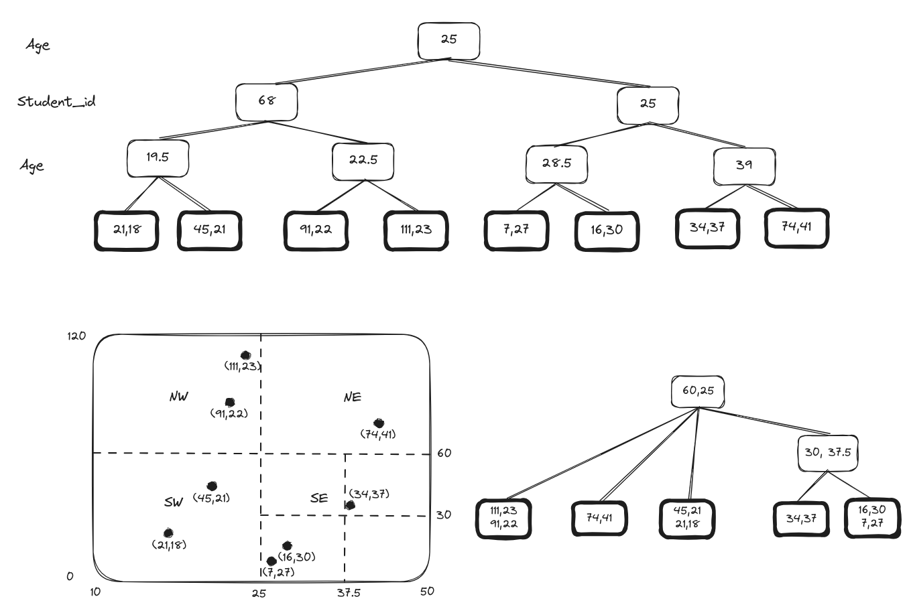

# Thesis proposal

### Database Systems and Information Management Group
### Fak. IV Electrical Engineering and Computer Science
### Technische Universität Berlin

## Towards an Optimal Physical Layout for Efficient Query Processing in the Cloud

[Full proposal](https://docs.google.com/document/d/1nbzh3fr4K43IC0BOh1CAkGEVsCmRzm1m/edit)

*Figure 1*

A motivating example is the following. We assume a context with a dataset consisting of two columns, student\_id and age (Figure 1). We consider three different approaches for the partitioning strategy: (a) clustering on one dimension, (b) kd-tree and (c) QuadTree (Figure 2). They respectively induce 4, 4 and 5 partitions, with the data distributed in different ways (Figure 3).

*Figure 2*

*Figure 3*

We use two example queries to compare them: Q1: selects all the columns where student\_id falls in range 40-70 and age is between 25 and 35; Q2: similar to Q1 but filters only one attribute, student\_id between 10 and 40. The approach (a) fetches 3 partitions for Q1 and 2 for Q2, showing better performance in the latter. Conversely, (b) and (c) retrieve 1 partition for Q1 - demonstrating an high pruning power for queries on multiple dimensions - and 3 for Q2 (Figure 4, 5). 

*Figure 4*

*Figure 5*

The artifacts will be implemented in C++. The multidimensional structures will include: Fixed-Grid, Grid-file, kd-tree, Quadtree, STRTree, Z-curve, Hilbert curve. A module for reading and writing Parquet partitions based on these structures will be included as well. Several datasets of relevant size with a high number of dimensions can be used in the benchmarks. A couple of open source datasets used in Flood and Tsunami will be considered: Taxi and TPC-H. In addition, the Genomic Multidimensional Range Query Benchmark (GMRQB) seems to fit this use case too. A set of relevant queries will be created. DuckDB will be used to evaluate the performance of the different partitioning techniques. The benchmarks will measure the number of partitions used in the queries across different selectivity, number of columns and partition size.
The system architecture is depicted in Figure 6.

*Figure 6*
